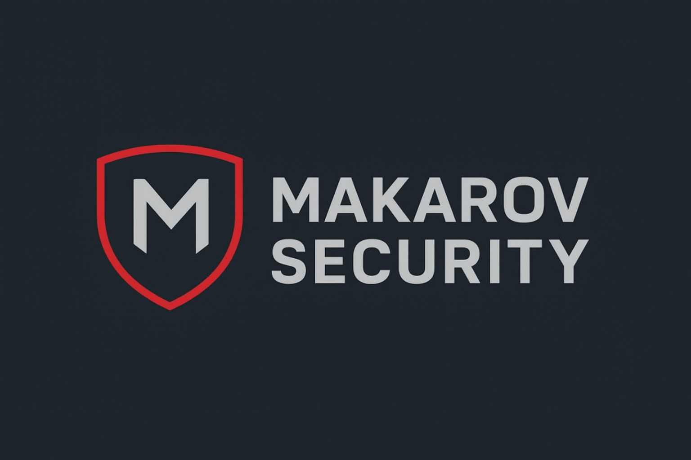

cd ~/MonGitHub
cat > README.md <<'EOF'
<p align="center">
  
</p>

<h1 align="center">⚡ Makarov Security Toolkit ⚡</h1>

<p align="center">
  <b>Pack d'outils Termux / scripts d'audit</b><br>
  <i>Collection personnelle de Makarov — pour tests légaux et apprentissage.</i>
</p>

<p align="center">
  <a href="https://github.com/Makarovababio/Makarovababio"></a>
  <a href="https://github.com/Makarovababio/Makarovababio/blob/main/LICENSE"></a>
  <a href="#"></a>
</p>

---

## ⚙️ Présentation
**Makarov Security Toolkit** regroupe une série de scripts et utilitaires destinés à faciliter les opérations d’audit, d’anonymisation et d’automatisation sur **Termux**.  
Ce dépôt contient uniquement des scripts légers et des instructions : aucune donnée lourde ni ressource illégale.

---

## 📦 Contenu principal
- `tools/whoami.sh` — script d'informations système et IP publique  
- `tools/update-termux.sh` — mettre à jour Termux et nettoyer  
- `tools/scan-port.sh` — scanner de ports basique (netcat)  
- `tools/wifi-info.sh` — infos Wi-Fi (termux-api si dispo)  
- `tools/extract-ip.sh` — récupérer IP publique et géolocalisation

---

## ▶️ Installation rapide (Termux)
```bash
pkg update -y && pkg upgrade -y
pkg install git curl nc termux-api -y
git clone git@github.com:Makarovababio/Makarovababio.git
cd Makarovababio
chmod +x tools/*.sh
bash tools/start-tor-firefox.sh
